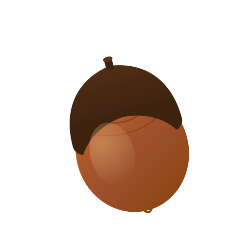

# AI-Switch

<p align="center">
  
</p>

<p align="center">
  <b>一套配置，任意电脑，即刻开工。</b>
</p>

<p align="center">
  告别重复配置 AI 编程工具的烦恼 —— 一次配置，云端同步，多端复用。
</p>

---

## 你是否有过这样的经历？

换了台电脑，Claude Code 要重新填 API Key、配模型；OpenCode 又得一个个加服务商。更别提不同场景要切换不同的模型方案 —— 工作时用 Opus，省钱时用 Haiku，每次手动改太麻烦了。

**AI-Switch** 就是来解决这个问题的。

---

## 核心能力

| 功能 | 说明 |
|------|------|
| 🔗 **多服务商管理** | 统一管理 OpenAI / Anthropic 格式的服务商，支持多 API Key、自动拉取模型列表 |
| ☁️ **一键云同步** | GitHub OAuth 登录，服务商配置 + 模型方案一键上传/下载，所有电脑保持一致 |
| 🎭 **Profile 方案** | 预设多个配置组合（工作模式 / 省钱模式 / 特定项目），点击即切换 |
| 📥 **本机导入** | 自动识别已安装的 Claude Code / OpenCode 配置，一键导入无需手动填写 |
| ⚡ **零依赖同步** | 只同步服务商和方案，每台电脑的工具开关各自独立，互不干扰 |

---

## 快速开始

1. 下载安装 → 打开 AI-Switch
2. 点击「模型设置」添加服务商（或点「本机导入」自动识别）
3. 点击头像登录 GitHub → 上传到云端
4. 在其他电脑上下载 → 配置即刻同步

---

## 开发

```bash
git clone https://github.com/N0tsLabs/AI-Switch.git
cd AI-Switch
npm install
npm run tauri dev

# 运行测试
npm test
cargo test --manifest-path src-tauri/Cargo.toml
```

### 技术栈

| 层 | 技术 |
|----|------|
| 桌面框架 | Tauri 2 |
| 前端 | React 19 + TypeScript + Tailwind CSS 4 |
| 状态管理 | Zustand |
| 后端 | Rust (reqwest, serde) |

---

## 贡献

欢迎提交 PR！无论是 Bug 修复、功能改进，还是文档完善，都非常欢迎。

在提交前请确保：

```bash
npm test               # 前端单元测试
npx tsc -b             # 类型检查
cargo test --manifest-path src-tauri/Cargo.toml  # Rust 测试
```

---

## License

MIT © N0tsLabs
